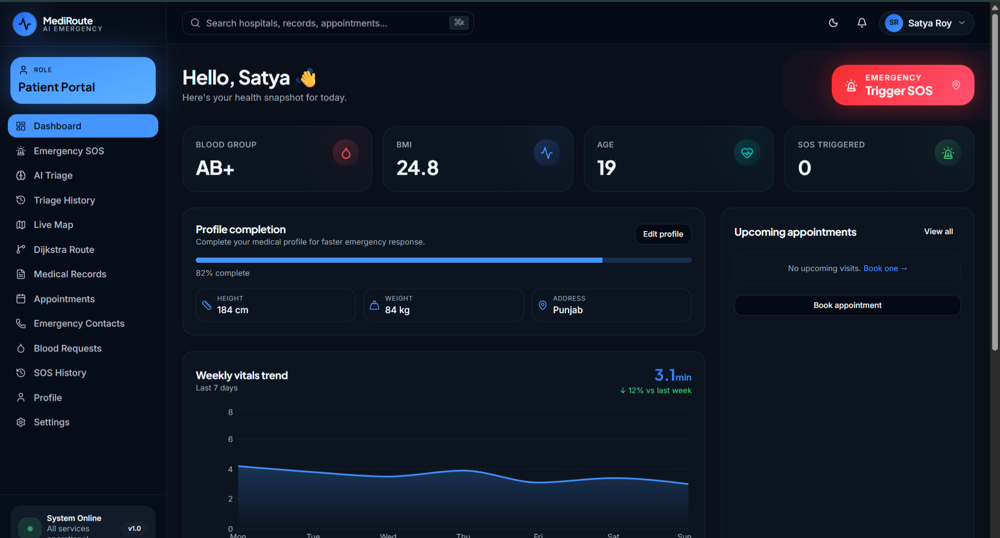
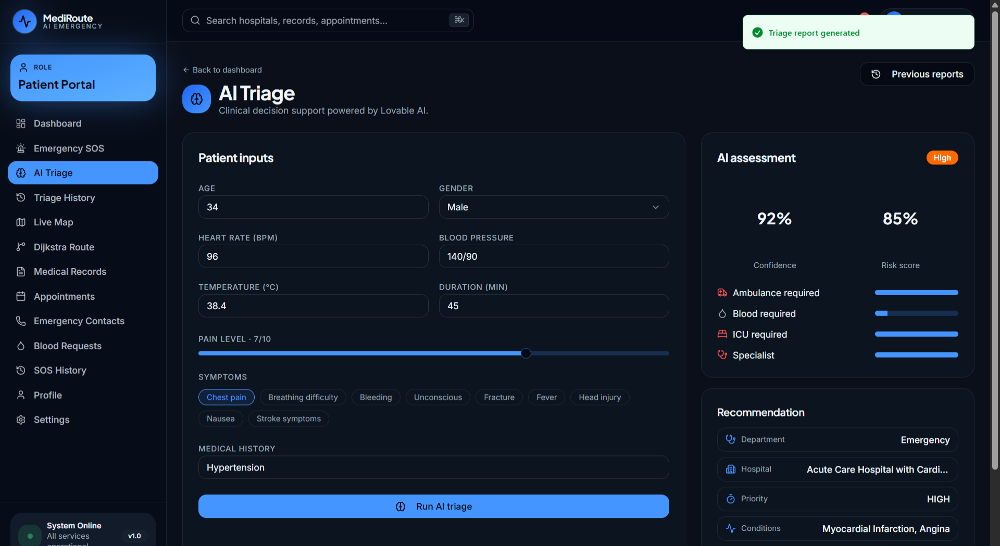
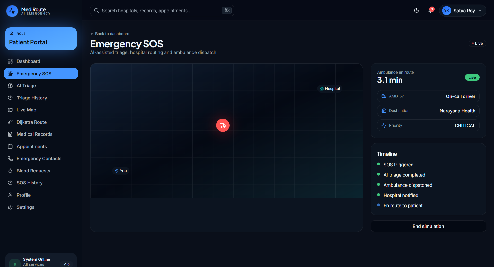
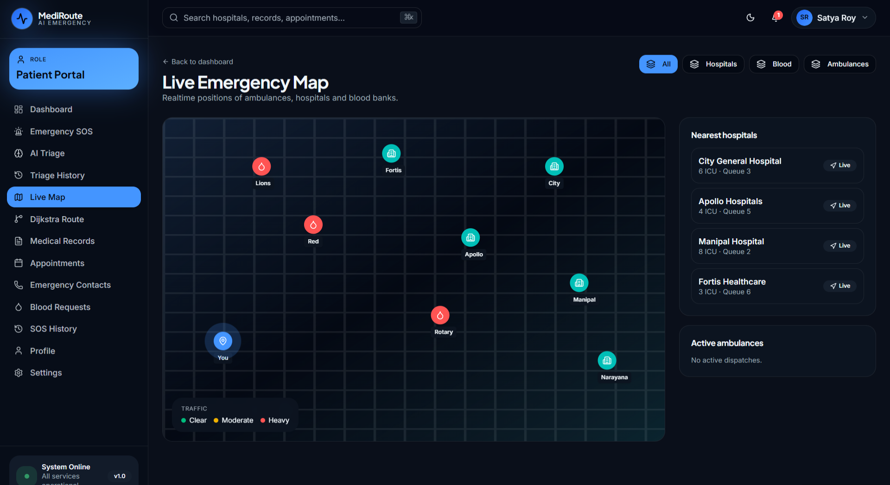
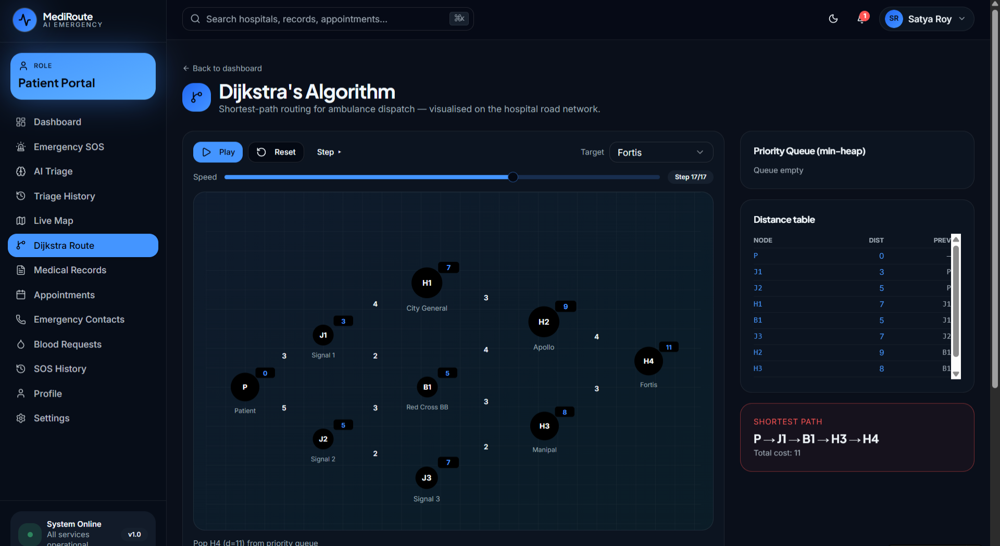

# 🏥 MediRoute AI
### AI-Powered Smart Emergency Healthcare Management System

<p align="center">
  
</p>

<p align="center">
  <strong>🚑 AI Medical Triage | 📍 Live Ambulance Tracking | 🩸 Blood Bank Network | 🏥 Hospital Management | 🚨 Emergency SOS</strong>
</p>

---

## 📖 Overview

**MediRoute AI** is an intelligent emergency healthcare platform developed to reduce emergency response time through Artificial Intelligence, real-time ambulance tracking, smart hospital routing, and integrated emergency management.

The system connects **Patients, Hospitals, Ambulances, Blood Banks, and Administrators** into a single digital platform capable of managing medical emergencies efficiently.

---

# ✨ Key Features

- 🤖 AI-powered Medical Triage
- 🚨 One-click Emergency SOS
- 📍 Live GPS Ambulance Tracking
- 🏥 Smart Hospital Routing
- 🩸 Blood Bank Management
- 📅 Appointment Scheduling
- 👨‍⚕️ Medical History Management
- 👥 Emergency Contacts
- 📊 Real-time Dashboards
- 🔔 Live Notifications
- 🔐 Secure Authentication
- ☁️ Supabase Backend Integration

---

# 🛠 Tech Stack

## Frontend
- React.js
- TypeScript
- Tailwind CSS
- TanStack Start
- Vite

## Backend
- Supabase
- PostgreSQL
- Supabase Authentication
- Row Level Security (RLS)

## AI
- Lovable AI Gateway
- Gemini AI

## Maps & Routing
- Leaflet Maps
- OpenStreetMap
- Dijkstra Shortest Path Algorithm

---

# 👥 User Modules

- 👤 Patient
- 🏥 Hospital
- 🚑 Ambulance
- 🩸 Blood Bank
- 👨‍💼 Administrator

---

# 📸 Project Screenshots

## Login Page

<p align="center">

</p>

---

## Patient Dashboard

<p align="center">

</p>

---

## AI Medical Triage

<p align="center">

</p>

---

## Emergency SOS

<p align="center">

</p>

---

## Live Map Tracking

<p align="center">

</p>

---

## Dijkstra Route Optimization

<p align="center">

</p>

---

# 🧠 System Workflow

```
Patient
      │
      ▼
AI Symptom Analysis
      │
      ▼
Emergency Detection
      │
      ▼
Nearest Hospital Search
      │
      ▼
Dijkstra Route Optimization
      │
      ▼
Nearest Ambulance Dispatch
      │
      ▼
Hospital Notification
      │
      ▼
Live Tracking
```

---

# 🔒 Security Features

- Secure Authentication
- Role-Based Access Control
- Protected Routes
- Supabase Row Level Security
- Secure Database Policies
- Real-Time Data Synchronization

---

# 🚀 Installation

Clone the repository

```bash
git clone https://github.com/SATYA-ROY-67/MediRoute-AI.git
```

Open the project

```bash
cd MediRoute-AI/vital-assist-nexus-main
```

Install dependencies

```bash
npm install
```

Create `.env`

```env
VITE_SUPABASE_URL=YOUR_SUPABASE_URL
VITE_SUPABASE_ANON_KEY=YOUR_SUPABASE_ANON_KEY
```

Run the project

```bash
npm run dev
```

Build

```bash
npm run build
```

---

# 📂 Project Structure

```
src/
├── components/
├── routes/
├── hooks/
├── lib/
├── styles/
├── assets/
└── utils/

supabase/
public/
Screenshots/
```

---

# 🎯 Future Enhancements

- Wearable Device Integration
- AI Disease Prediction
- Voice-enabled Emergency Assistant
- Offline Emergency Mode
- Telemedicine Support
- Multi-language Support

---

# 👨‍💻 Developer

**Satyajeet Roy Chaudhary**

Bachelor of Technology (Computer Science Engineering)

Lovely Professional University

---

# 📄 Project Report

The detailed project documentation is available inside this repository.

- 📘 MediRoute_AI_Project_Report.pdf

---

# 📜 License

This project is developed for educational and academic purposes.

---

<p align="center">

⭐ If you like this project, consider giving it a star!

</p>
